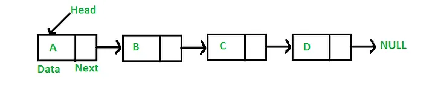
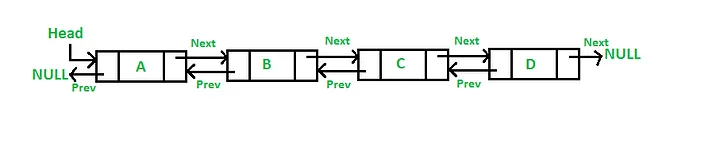

# Requirements
Your goal is to build two linked list data structures that meet the following requirements:

## Step 1:
- Add a class: SingleLinkedList
- Your SingleLinkedList will be composed of nodes. 
- Classes should be generic, capable of storing any kind of data within its nodes. See [Info] Generics In Code for help on generics.
- Each list class should have the following functions/properties:
    - Add(T val) – puts a new value at the Tail end of the list
    - Insert(T val, int index) – inserts a new value at a given index, pushing the existing value at that index to the next index spot, and so on. Insert may ONLY target indices that are currently in use. In other words, if you have 5 elements in your list, you may insert at any index between 0 and 4 inclusive. Index 5 would be considered out of bounds as it is not currently in use during the insertion process.
        - Any index less than zero or equal to or greater than count should throw an index out of bounds exception.
    - Count – returns the number of values in the list. This should be a property. In certain coding languages this is typically protected through getters/setters. For efficiency, the count value should be a managed value (stored and updated as needed) and not simply derived each time Count is called.
    - Get(int index) – returns the value at the given index.
        - Any index less than zero or equal to or greater than count should be handled
    - Remove – removes and returns the first value in the list. (Decide what happens when the list is empty)
    - RemoveAt(int index) –removes and returns the value at a given index.
        - Any index less than zero or equal to or greater than count should throw an index out of bounds exception.
    - RemoveLast – removes and returns the last value in the list. (Decide what happens when the list is empty)
    - ToString – an override method that creates and returns a string representation of all the values in the list. The string must be in the format of “v0, v1, v2, .., vn-1” where n-1 is the last index in the list. An empty list should return an empty string (but not null). While every value in the string is separated by a comma and space, the string must NOT have any unnecessary commas or spaces at the beginning or end.
    - Clear – removes all values in the list.
    - Search(T val) – searches for a value in the list and returns the first index of that value when found.
        - If the key is not found in the list, the method returns -1.
- Any function that adds or removes values from the list MUST impact Count accordingly.
- Write at least 2 tests against each of your algorithm/methods to validate its proper and correct function.

## Step 2:
- Now that your SingleLinkedList is completed, create a DoubleLinkedList 
    - Make sure to make a copy of your SingleLinkedList (renaming it) before getting started.

## Rubric:

| Criteria                                                                                                                                                                 | Ratings                        | Pts       |
| ------------------------------------------------------------------------------------------------------------------------------------------------------------------------ | :------------------------------: | :---------: |
| Created the SingleLinkedList   SingleLinkedList is created with all required methods.                                   | 0-2                            | 2 pts     |
| Create the DoubleLinkedList   DoubleLinkedList is created with all required methods.                                   | 0-2                            | 2 pts     |
| LinkedLists incorporated generics   Make your linked lists utilize generics to support more data types                      | 0-2 | 2 pts |
| Unit Tests for both Lists   Create at least 2 tests for each method inside your LinkedList for each type (single & double). | 0-4 | 4 pts |
|                                                                                                                                |     | Total Points: 10 |
